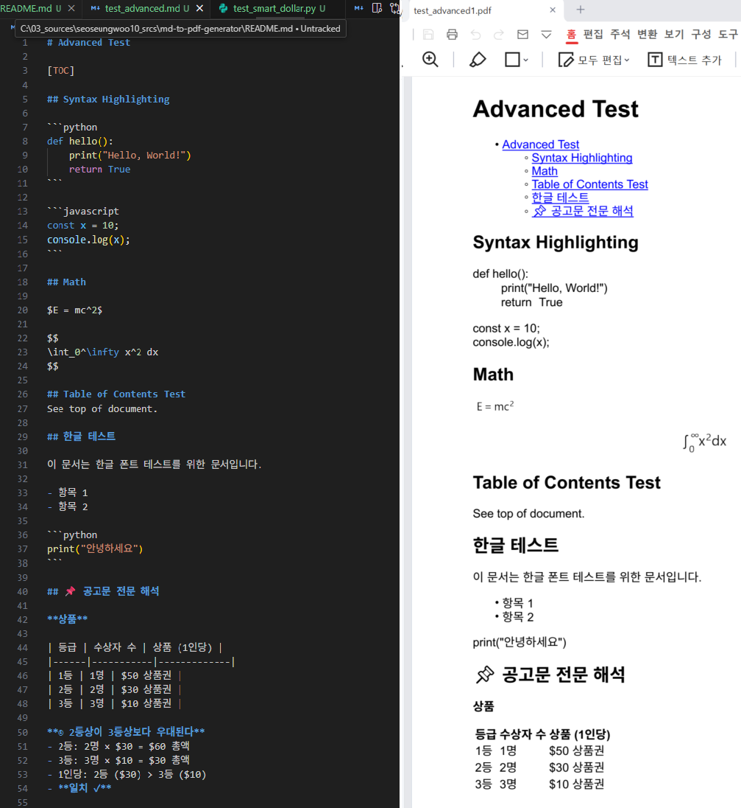

# MD2PDF Generator

A powerful CLI tool to convert Markdown files to high-quality PDF documents.

## Features

- **Markdown Support**: Full support for standard Markdown, tables, and metadata.
- **Syntax Highlighting**: Automatic code highlighting using Pygments.
- **Math Support**: Renders LaTeX formulas using Matplotlib for high-quality images.
- **Table of Contents**: Auto-generate TOC with `--toc`.
- **Themes**: Built-in themes (`github`, `dark`, `light`, `minimal`) and custom CSS support.
- **Batch Conversion**: Convert entire directories recursively with parallel processing.
- **Configuration**: Save your preferences in `.md2pdf.yaml`.
- **Standalone Executable**: Available as a portable `.exe` for Windows with all dependencies bundled.

## Result Markdown to Pdf




## Installation

### Option 1: Standalone Executable (Recommended for Windows)

The standalone executable includes all necessary dependencies (GTK3, Python, libraries), so no installation is required.

1.  Download `md2pdf.exe` from the releases (or build it yourself).
2.  Run it directly from the command line.

### Option 2: Run from Source

1.  **Prerequisites**:
    -   Python 3.10+
    -   **GTK3 Runtime**: Required for WeasyPrint.
        -   **Recommended**: Install via **MSYS2** (`pacman -S mingw-w64-x86_64-pango`).
        -   See [docs/setup_gtk3_windows.md](docs/setup_gtk3_windows.md) for detailed instructions.

2.  Clone and Install:
    ```bash
    git clone <repository-url>
    cd md2pdf-generator
    pip install -r requirements.txt
    ```

## Usage

### Using the Executable (`md2pdf.exe`)

#### 1. Convert a Single File
```powershell
.\dist\md2pdf.exe convert input.md -o output.pdf
```

#### 2. Batch Convert a Directory
Recursively convert all `.md` files in `examples/md2` to `examples/pdf2`:
```powershell
.\dist\md2pdf.exe batch-convert "examples/md2" -o "examples/pdf2" -r
```

#### 3. Apply a Theme
```powershell
.\dist\md2pdf.exe convert input.md -o output.pdf --style dark
```

### Using Python Source

#### 1. Convert a Single File
```bash
python -m src.cli convert input.md -o output.pdf
```

#### 2. Batch Convert a Directory
```bash
python -m src.cli batch-convert "examples/md2" -o "examples/pdf2" -r
```

#### 3. Apply a Theme
```bash
python -m src.cli convert input.md -o output.pdf --style dark
```

## Configuration

Create a `.md2pdf.yaml` file in your project root or home directory.

| Option | CLI Flag | Config Key | Default | Description |
|--------|----------|------------|---------|-------------|
| **Style** | `-s`, `--style` | `style` | `github` | Theme name (`github`, `dark`, `light`, `minimal`) |
| **Custom CSS** | `--css` | N/A | `None` | Path to a custom CSS file |
| **Table of Contents** | `--toc` | `toc` | `False` | Generate a Table of Contents |
| **Recursive** | `-r`, `--recursive` | `recursive` | `False` | Process directories recursively (batch only) |
| **Workers** | `-w`, `--workers` | `workers` | CPU Count | Number of parallel processes (batch only) |
| **Font Size** | N/A | `font_size` | `11` | Base font size (in pt) |
| **Page Size** | N/A | `page_size` | `A4` | Page size (`A4`, `Letter`, etc.) |

## Math Support

We use **Matplotlib** to render LaTeX equations as images.

**Syntax:**
-   **Inline Math**: `\( E=mc^2 \)`
-   **Block Math**:
    ```latex
    \[
    \int_0^\infty x^2 dx
    \]
    ```

> **Note**: The `$` symbol is treated as a currency symbol by default (e.g., `$10`). To use math, please use the `\(...\)` and `\[...\]` delimiters.

## Building Executable

To build the standalone executable yourself:

1.  Ensure you have the MSYS2 GTK3 environment set up (see docs).
2.  Run PyInstaller:
    ```bash
    pip install pyinstaller
    pyinstaller --clean md2pdf.spec
    ```
3.  The executable will be created in `dist/md2pdf.exe`.

## Running Tests

```bash
python -m unittest discover tests
```
